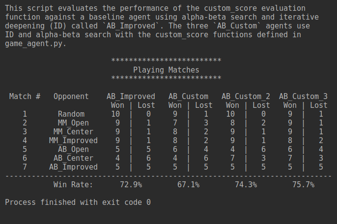

### heuristic_analysis

Your analysis should conclude with a comparison of the different heuristics and your 
reasoning for choosing the heuristic you ultimately use in your submitted agent.

* This script evaluates the performance of the custom_score evaluation
function against a baseline agent using alpha-beta search and iterative
deepening (ID) called `AB_Improved`. The three `AB_Custom` agents use
ID and alpha-beta search with the custom_score functions defined in
game_agent.py.

#### Each code Calculate the heuristic value of a game state from the point of view of the given player.


```python
def custom_score(game, player):
    loser_winner(player,game)
    player_move = len(game.get_legal_moves(player))
    opponent_moves = len(game.get_legal_moves(game.get_opponent(player)))
    blank_spaces = len(game.get_blank_spaces())
    return float((blank_spaces-opponent_moves)*player_move-opponent_moves)


def custom_score_2(game, player):
    loser_winner(player,game)
    my_moves = len(game.get_legal_moves(player))
    opponent_moves = len(game.get_legal_moves(game.get_opponent(player)))
    blank_spaces = len(game.get_blank_spaces())
    return float(my_moves*(blank_spaces-1) - opponent_moves*(blank_spaces))


def custom_score_3(game, player):
    loser_winner(player,game)
    my_moves = len(game.get_legal_moves(player))
    opponent_moves = len(game.get_legal_moves(game.get_opponent(player)))
    return float(my_moves - 3*opponent_moves)
```

## Tournament: 
**For each of your three custom heuristic functions, evaluate the performance of the heuristic using the included tournament.py scrip**
    
### The tournament opponents are listed below.

* Random: An agent that randomly chooses a move each turn.
* MM_Null: CustomPlayer agent using fixed-depth minimax search and the null_score heuristic
* MM_Open: CustomPlayer agent using fixed-depth minimax search and the open_move_score heuristic
* MM_Improved: CustomPlayer agent using fixed-depth minimax search and the improved_score heuristic
* AB_Null: CustomPlayer agent using fixed-depth alpha-beta search and the null_score heuristic
* AB_Open: CustomPlayer agent using fixed-depth alpha-beta search and the open_move_score heuristic
* AB_Improved: CustomPlayer agent using fixed-depth alpha-beta search and the improved_score heuristic


## Tournament Results



**Winner: **AB_Custom_3 has the highest win rate: 75.7% followed by AB_Custom_2 with 74.3%

### Reasoning: 
1. Highest Overal **Winning Rate**
2. Less Complex in compare to other cutome model.
